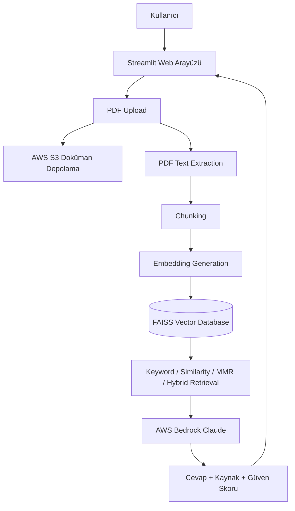

<p align="center">

  
  
  
  

  <br/>

  
  
  
  

</p>

# 📄 AWS Tabanlı RAG Doküman Soru-Cevap Sistemi

## 1. Proje Bilgileri

**Proje Adı:** AWS Tabanlı RAG Doküman Soru-Cevap Sistemi  
**Konu:** Retrieval Augmented Generation tabanlı akıllı doküman soru-cevap sistemi  
**Bulut Platformu:** AWS  
**LLM Servisi:** AWS Bedrock  
**Depolama:** AWS S3  
**Arayüz:** Streamlit  
**Vektör Veritabanı:** FAISS  

| İsim Soyisim | Öğrenci Numarası |
|---|---|
| Emre Yasin Yıldan | 231307058 |

---

# 📌 2. Giriş ve Problem Tanımı

Günümüzde PDF, ders notu, proje dokümanı, teknik şartname, makale ve rapor gibi dijital dokümanların sayısı hızla artmaktadır. Bu dokümanlar içerisinde istenen bilgiye ulaşmak çoğu zaman zaman alıcıdır.

Geleneksel arama yöntemleri genellikle anahtar kelime eşleşmesine dayanır. Ancak kullanıcı farklı bir ifadeyle soru sorduğunda klasik arama yöntemleri doğru bilgiye ulaşmakta yetersiz kalabilir.

Bu proje kapsamında geliştirilen sistem, kullanıcıların PDF dokümanlarını yükleyip doğal dil ile soru sorabilmesini sağlar. Sistem, ilgili doküman parçalarını bulur ve AWS Bedrock üzerinde çalışan Claude modeli ile cevap üretir.

Projenin temel amaçları:

* Büyük PDF dokümanlarından bilgiye hızlı erişim sağlamak
* Doğal dil ile dokümana soru sorulabilmesini sağlamak
* Doküman içeriğine dayalı güvenilir cevap üretmek
* Cevapların hangi sayfalara dayandığını göstermek
* Keyword Search, Similarity Search, MMR ve Hybrid Retrieval yöntemlerini karşılaştırmak
* AWS S3 ve AWS Bedrock servislerini gerçek bir AI sisteminde kullanmak
* Deneysel analiz, grafik ve CSV çıktısı üretmek

---

# 🧠 3. Kuramsal Arka Plan

## 3.1 Retrieval Augmented Generation Nedir?

Retrieval Augmented Generation, yani RAG, büyük dil modellerinin dış kaynaklardan bilgi alarak cevap üretmesini sağlayan bir mimaridir.

Klasik LLM sistemlerinde model yalnızca kendi eğitim verisine dayanarak cevap üretir. RAG sistemlerinde ise önce kullanıcı sorusuyla ilgili doküman parçaları bulunur, daha sonra bu parçalar LLM’e bağlam olarak verilir.

Bu sayede:

* Cevaplar dokümana dayalı olur
* Hallucination riski azalır
* Model güncel veya kullanıcıya özel dokümanlarla çalışabilir
* Cevapların kaynakları gösterilebilir

---

## 3.2 Chunk Nedir?

Büyük dokümanların küçük metin parçalarına bölünmüş haline **chunk** denir.

Örneğin 200 sayfalık bir PDF doğrudan modele verilmez. Bunun yerine sistem dokümanı küçük parçalara ayırır.

```text
Chunk 1 → Sayfa 1-2
Chunk 2 → Sayfa 2-3
Chunk 3 → Sayfa 3-4
```

Chunk kullanmanın amacı:

* Büyük dokümanı daha yönetilebilir hale getirmek
* Soru ile en alakalı bölümleri bulmak
* Token maliyetini azaltmak
* Retrieval doğruluğunu artırmak

---

## 3.3 Chunk Size Nedir?

Chunk size, her bir parçanın yaklaşık metin uzunluğunu ifade eder.

Örneğin:

```text
Chunk Size = 500
```

ise her chunk yaklaşık 500 karakterlik metin içerir.

Küçük chunk size:

* Daha spesifik sonuçlar verir
* Kısa tanım sorularında başarılıdır
* Ancak bağlam kaybına neden olabilir

Büyük chunk size:

* Daha fazla bağlam sağlar
* Liste ve uzun açıklama sorularında başarılıdır
* Ancak gereksiz bilgi getirme ihtimali artar

---

## 3.4 Chunk Overlap Nedir?

Chunk overlap, iki chunk arasında ortak bırakılan metin miktarıdır.

Örnek:

```text
Chunk 1 → abcdefghij
Chunk 2 → ghijklmnop
```

Buradaki `ghij` kısmı overlap olarak düşünülebilir.

Overlap sayesinde:

* Cümleler bölünse bile bağlam korunur
* Önemli bilgiler chunk sınırında kaybolmaz
* Retrieval kalitesi artar

---

## 3.5 Embedding Nedir?

Embedding, metinlerin sayısal vektörlere dönüştürülmesidir.

Bu sayede sistem metinlerin yalnızca kelime olarak değil, anlam olarak da birbirine yakın olup olmadığını anlayabilir.

Örneğin:

```text
“Fonksiyon nasıl yazılır?”
```

ile

```text
“PHP function yapısı nedir?”
```

farklı kelimeler içerse bile anlam olarak birbirine yakındır.

---

## 3.6 Vector Database Nedir?

Vector database, embedding vektörlerinin saklandığı ve benzerlik araması yapılan yapıdır.

Bu projede lokal vektör veritabanı olarak **FAISS** kullanılmıştır.

FAISS sayesinde:

* Doküman parçaları embedding olarak saklanır
* Kullanıcı sorusuna en yakın parçalar bulunur
* Semantic search yapılabilir

---

## 3.7 Top-k Nedir?

Top-k, retrieval sırasında modele gönderilecek en alakalı chunk sayısını ifade eder.

Örneğin:

```text
Top-k = 5
```

ise sistem en alakalı 5 chunkı bulur ve LLM’e gönderir.

Küçük top-k:

* Daha hızlıdır
* Daha düşük maliyetlidir
* Ancak bazı bilgiler kaçabilir

Büyük top-k:

* Daha kapsamlı cevap sağlar
* Ancak cevap süresi ve maliyet artabilir

---

# 🏗️ 4. Sistem Mimarisi



Bu mimaride kullanıcı PDF dokümanı yükler. Doküman AWS S3’e kaydedilir ve aynı zamanda metne dönüştürülür. Metin chunklara ayrılır, embedding vektörleri oluşturulur ve FAISS üzerinde saklanır. Kullanıcı soru sorduğunda sistem ilgili chunkları bulur ve AWS Bedrock Claude modeli ile cevap üretir.

---

# 📦 5. Sistem Modülleri

## 5.1 PDF Yükleme Modülü

Kullanıcı arayüzü üzerinden PDF dosyası yüklenebilir.

### Özellikler

* PDF dosyası seçme
* PDF dosyasını geçici olarak işleme
* AWS S3’e yükleme
* Doküman adını session state içinde saklama

---

## 5.2 AWS S3 Depolama Modülü

Yüklenen PDF dosyası AWS S3 bucket içerisine kaydedilir.

### Özellikler

* PDF dosyasını bulutta saklama
* S3 URI oluşturma
* Doküman arşivleme
* Bulut tabanlı doküman yönetimi

---

## 5.3 PDF Text Extraction Modülü

PDF içerisindeki metinler `pypdf` kütüphanesi ile sayfa bazlı çıkarılır.

### Özellikler

* Sayfa sayfa metin okuma
* Sayfa numarası bilgisini metne ekleme
* Citation system için kaynak sayfa bilgisini koruma

Örnek:

```text
--- Sayfa 4 ---
Rapor aşağıdaki bölümleri içermelidir...
```

---

## 5.4 Chunking Modülü

Çıkarılan metinler küçük parçalara ayrılır.

### Kullanılan Ayarlar

| Mod | Chunk Size | Chunk Overlap |
|---|---:|---:|
| Hızlı | 300 | 100 |
| Dengeli | 500 | 150 |
| Detaylı | 800 | 200 |

Chunking işlemi sayesinde dokümanın tamamı yerine yalnızca ilgili bölümler modele gönderilir.

---

## 5.5 Embedding Modülü

Chunk metinleri embedding modelinden geçirilerek sayısal vektörlere dönüştürülür.

### Kullanılan Model

```text
sentence-transformers/all-MiniLM-L6-v2
```

Bu model, metinleri semantik olarak karşılaştırılabilir vektörlere dönüştürür.

---

## 5.6 FAISS Vector Database Modülü

Embedding vektörleri FAISS üzerinde saklanır.

### Özellikler

* Hızlı vektör arama
* Semantic search desteği
* Lokal vector database yapısı
* Düşük maliyetli retrieval altyapısı

---

## 5.7 Retrieval Modülü

Sistemde dört farklı retrieval yöntemi bulunmaktadır.

### Keyword Search

Soru içerisindeki kelimeleri chunklarda birebir arar.

### Similarity Search

Embedding vektörleri üzerinden anlamsal benzerlik araması yapar.

### MMR Retrieval

Hem alakalı hem de birbirinden farklı chunkları getirir.

### Hybrid Retrieval

Keyword, similarity ve MMR sonuçlarını birleştirir.

Bu yöntem sistemin en kapsamlı retrieval modudur.

---

## 5.8 AWS Bedrock Cevap Üretim Modülü

Retrieved chunklar AWS Bedrock üzerinde çalışan Claude modeline gönderilir.

### Özellikler

* Doküman içeriğine dayalı cevap üretme
* Türkçe cevap desteği
* Liste sorularında maddeleri eksiksiz aktarma
* Ek açıklama üretme
* Cevabı doküman bağlamına dayandırma

---

## 5.9 Citation System Modülü

Sistem cevabın hangi sayfalara dayandığını gösterir.

Örnek:

```text
📌 Kaynak: Sayfa 4, Sayfa 5
```

Kaynaklar bölümünde ayrıca:

* Sayfa numarası
* Arama yöntemi
* Retrieval skoru
* Kullanılan doküman parçası

gösterilir.

---

## 5.10 Confidence Score Modülü

Sistem kullanılan retrieval yöntemi ve kaynak sayısına göre basit bir güven skoru üretir.

Örnek:

```text
📊 Güven Skoru: %91
```

Bu değer, cevabın kaynak desteği açısından ne kadar güçlü olduğunu gösterir.

---

## 5.11 Deneysel Analiz Modülü

Sistem her soru-cevap işleminde deney kaydı oluşturur.

### Kaydedilen Veriler

* Doküman adı
* Soru
* Kullanılan model
* Cevap modu
* Chunk size
* Chunk overlap
* Top-k
* Retrieval yöntemi
* Cevap süresi
* Kaynak sayısı
* Doğruluk değerlendirmesi

Sonuçlar tablo olarak görüntülenebilir ve CSV olarak indirilebilir.

---

# 🔍 6. Retrieval Yöntemleri Karşılaştırması

| Yöntem | Avantaj | Dezavantaj |
|---|---|---|
| Keyword Search | Hızlıdır, başlıkları iyi yakalar | Anlamsal benzerliği yakalayamaz |
| Similarity Search | Anlam tabanlı arama yapar | Benzer chunkları tekrar getirebilir |
| MMR Retrieval | Farklı bağlamlardan bilgi toplar | Keyword kadar doğrudan başlık odaklı değildir |
| Hybrid Retrieval | En kapsamlı ve dengeli sonuçları üretir | Daha fazla işlem gerektirir |

---

# ⚙️ 7. Cevap Modları

| Mod | Chunk Size | Top-k | Retrieval |
|---|---:|---:|---|
| Hızlı | 300 | 3 | Similarity |
| Dengeli | 500 | 5 | MMR |
| Detaylı | 800 | 8 | MMR / Hybrid |

### Hızlı Mod

Kısa tanım soruları için uygundur.

### Dengeli Mod

Genel kullanım için önerilir.

### Detaylı Mod

Uzun dokümanlar, liste soruları ve kapsamlı cevaplar için uygundur.

---

# 🧪 8. Test Senaryoları

| Test | Beklenen Sonuç | Durum |
|---|---|---|
| PDF yükleme | PDF sisteme yüklenir | Başarılı |
| S3 upload | PDF AWS S3’e kaydedilir | Başarılı |
| PDF text extraction | PDF metne dönüştürülür | Başarılı |
| Chunking | Metin parçalara ayrılır | Başarılı |
| Embedding generation | Chunklar vektöre dönüştürülür | Başarılı |
| Keyword search | Birebir kelime eşleşmeleri bulunur | Başarılı |
| Similarity search | Anlamsal olarak yakın chunklar bulunur | Başarılı |
| MMR retrieval | Farklı bağlamlardan chunklar getirilir | Başarılı |
| Hybrid retrieval | Birleşik retrieval sonucu üretilir | Başarılı |
| AWS Bedrock cevap | Claude modeli cevap üretir | Başarılı |
| Citation system | Sayfa kaynakları gösterilir | Başarılı |
| Confidence score | Güven skoru hesaplanır | Başarılı |
| CSV export | Deney sonuçları indirilebilir | Başarılı |

---

# 🧠 9. Tasarım Kararları

## RAG Neden Kullanıldı?

Çünkü sistemin yalnızca genel bilgiye değil, kullanıcının yüklediği dokümana dayalı cevap üretmesi gerekmektedir.

## FAISS Neden Kullanıldı?

FAISS hızlı, ücretsiz ve lokal geliştirme için uygun bir vector database çözümü sunduğu için tercih edilmiştir.

## AWS Bedrock Neden Kullanıldı?

Bedrock, büyük dil modellerine yönetilen bir AWS servisi üzerinden erişim sağladığı için kullanılmıştır.

## AWS S3 Neden Kullanıldı?

PDF dosyalarını bulutta saklamak ve projeye gerçek bir cloud storage katmanı eklemek için kullanılmıştır.

## Hybrid Retrieval Neden Eklendi?

Tek bir retrieval yöntemi her soru tipi için yeterli değildir. Bu nedenle keyword, similarity ve MMR yöntemleri birleştirilmiştir.

## Citation System Neden Eklendi?

Kullanıcının cevabın hangi sayfalara dayandığını görebilmesi için eklenmiştir. Bu özellik explainable AI yaklaşımını güçlendirir.

---

# ⚠️ 10. Karşılaşılan Problemler ve Çözümleri

| Problem | Çözüm |
|---|---|
| Bedrock model ID hatası | Aktif inference profile ID kullanıldı |
| Legacy model hatası | Claude Haiku için güncel model/inference profile seçildi |
| Cevapların yarıda kesilmesi | BEDROCK_MAX_TOKENS artırıldı |
| Liste cevaplarının eksik gelmesi | Prompt liste soruları için güçlendirildi |
| Başlıkların yanlış bulunması | Keyword ve hybrid retrieval eklendi |
| Benzer chunkların tekrar gelmesi | MMR retrieval eklendi |
| Kaynak gösterimi eksikti | Sayfa bazlı citation system geliştirildi |
| Türkçe karakterli CSV bozulması | UTF-8-SIG encoding kullanıldı |
| Streamlit sidebar/girinti hataları | Kod blokları düzenlendi |

---

# 📊 11. Deneysel Analiz

Sistemde deneysel analiz için cevap süresi, retrieval yöntemi, chunk size, top-k, kaynak sayısı ve doğruluk değerlendirmesi kaydedilmektedir.

Bu analiz sayesinde farklı retrieval yöntemleri karşılaştırılabilir.

Örnek karşılaştırmalar:

* Keyword Search vs Similarity Search
* Similarity Search vs MMR Retrieval
* MMR Retrieval vs Hybrid Retrieval
* Hızlı mod vs Detaylı mod
* Chunk size etkisi
* Top-k etkisi

---

# 📚 12. Kaynakça

* AWS Bedrock Documentation: https://docs.aws.amazon.com/bedrock/
* AWS S3 Documentation: https://docs.aws.amazon.com/s3/
* FAISS Documentation: https://faiss.ai/
* Streamlit Documentation: https://docs.streamlit.io/
* Sentence Transformers Documentation: https://www.sbert.net/
* LangChain Documentation: https://python.langchain.com/
* pypdf Documentation: https://pypdf.readthedocs.io/
* Retrieval-Augmented Generation Paper: https://arxiv.org/abs/2005.11401

---

# 🚀 13. Kurulum ve Çalıştırma

```bash
git clone <repo-link>
cd rag-doc-qa
python -m venv .venv
.venv\Scripts\activate
pip install -r requirements.txt
aws configure
python -m streamlit run app.py
```

---

# 🔐 14. Ortam Değişkenleri

`.env` dosyası aşağıdaki formatta oluşturulmalıdır:

```env
AWS_REGION=eu-west-1
BEDROCK_MODEL_ID="AWS Console'dan gelen id girilecek"
BEDROCK_MAX_TOKENS=800
BEDROCK_TEMPERATURE=0.1
AWS_S3_BUCKET_NAME=<bucket-name>
```

---

# ✅ 15. Proje Özellik Özeti

* PDF yükleme
* AWS S3 doküman depolama
* PDF text extraction
* Chunking
* Chunk overlap
* Embedding generation
* FAISS vector database
* Keyword Search
* Similarity Search
* MMR Retrieval
* Hybrid Retrieval
* AWS Bedrock Claude entegrasyonu
* Citation system
* Confidence score
* Cevap süresi ölçümü
* Deney tablosu
* Grafik üretimi
* CSV export
* Doğruluk değerlendirme
* Streamlit web arayüzü

# 16. PROJE TEST KISMI 

Projeyi test etmek için kullanılan PDF:

## Sample PDF

https://github.com/EmreYildan/rag-doc-qa.git/blob/main/data/sample_pdfs/Resmi_Gazete.pdf

[PDF'i Aç](data/sample_pdfs/Resmi_Gazete.pdf)


- 1.Soru Düzenlemenin uygulanmasından hangi kurum sorumludur?
- 2.Soru Düzenlemede geçen geçici maddeler nelerdir?
- 3.Soru Yönetmelikte hangi tanımlar yapılmıştır?
